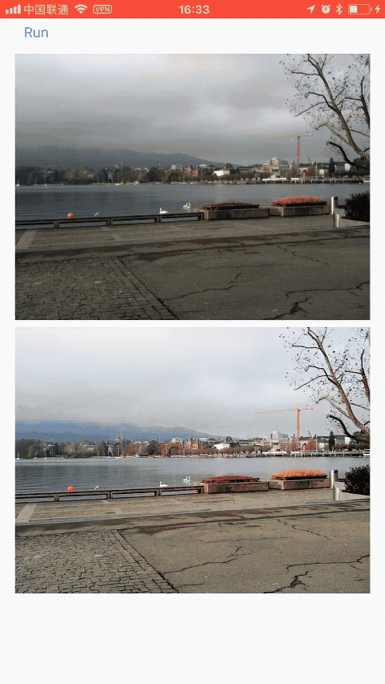

# CoreML version of [DSLR](https://github.com/aiff22/DPED)

## DSLR-Quality Photos on Mobile Devices with Deep Convolutional Networks

 

 

#### 1. Overview [[paper]](https://arxiv.org/pdf/1704.02470.pdf) [[project webpage]](http://dped-photos.vision.ee.ethz.ch) 

The provided code implements the paper that presents an end-to-end deep learning approach for translating ordinary photos from smartphones into DSLR-quality images. The learned model can be applied to photos of arbitrary resolution, while the methodology itself is generalized to 
any type of digital camera. More visual results can be found [here](http://people.ee.ethz.ch/~ihnatova/#demo).

## Results

with image size: 1024*768,  process avg time is 4s on iPhone8 Plus

